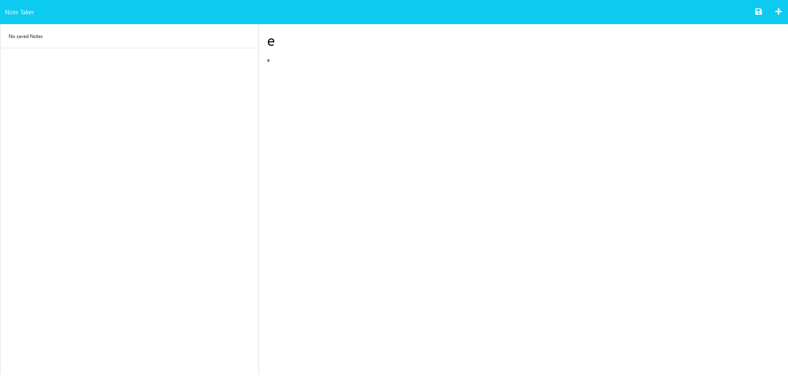

  # Note Taker
  
  

  ## Table of Contents
  - [Description](#Description)
  - [Installation](#Installation)
  - [Usage](#Usage)
  - [Contribution](#Contribution)
  - [License](#License)
  
  
  
  ## Description
  Application used to write and save notes.

  ## Installation
  No installation necessary. Visit [https://glowingchainsaw.herokuapp.com/](https://glowingchainsaw.herokuapp.com/) to use the application.

  ## Usage
  Click 'get started' and type in a note title and body. Click the floppy disk icon at the top right to add it to your note collection.

  ## Contribution Guidelines
  Users wishing to contribute ought to consult the license and see what kinds of requirements are allowed for contribution.

  ## License
  [This project is licensed under the GNU General Public License, version 3.](https://www.gnu.org/licenses/gpl-3.0)
